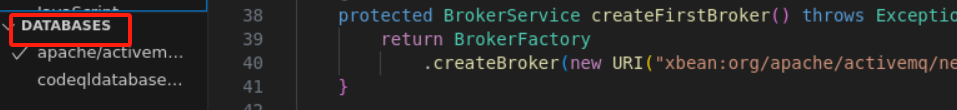
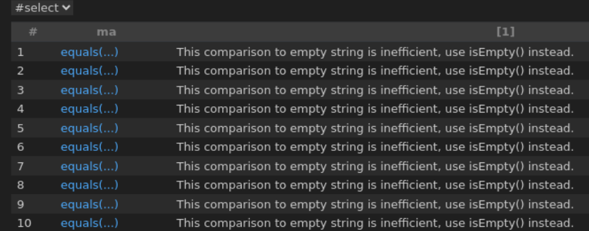

## Java 和 Kotlin 代码的基本查询

学习编写并运行一个简单的 CodeQL 查询。

学习如何使用 Visual Studio Code 中的 CodeQL 扩展来编写和运行一个简单的 CodeQL 查询。

有关安装 Visual Studio Code 的 CodeQL 扩展的信息，请参见“为 Visual Studio Code 安装 CodeQL”。

### 关于查询

我们将运行的查询搜索效率低下的空字符串测试。例如，如下 Java 代码：

```java
public class TestJava {
    void myJavaFun(String s) {
        boolean equals = s.equals("");
    }
}
```
或 Kotlin 代码：

```kotlin
fun myKotlinFun(s: String) {
    val equals = s.equals("")
}

```
在任一情况下，将 s.equals("") 替换为 s.isEmpty() 将更有效率。

### 寻找 CodeQL 数据库进行实验
在开始为 Java/Kotlin 代码编写查询之前，您需要一个 CodeQL 数据库来运行它们。最直接的方法是从 GitHub.com 直接下载使用 Java/Kotlin 的存储库的数据库。

- 在 Visual Studio Code 中，点击左侧边栏中的 QL 图标以显示 CodeQL 扩展。

- 点击 CodeQL 扩展顶部的 From GitHub 或 GitHub 徽标，以打开输入字段。

- 将存储库的 URL 复制到字段中，并按键盘 Enter 键。例如，https://github.com/apache/activemq 

- 可选地，如果存储库有多个 CodeQL 数据库可用，请选择 java 以下载由 Java/Kotlin 代码创建的数据库。

Visual Studio Code 右下角将显示数据库下载进度的信息。下载完成后，数据库将在 CodeQL 扩展的 Databases 部分显示一个勾号（见下面的截图）。


### 运行快速查询
Visual Studio Code 的 CodeQL 扩展添加了几个 CodeQL: 命令到命令面板，包括 Quick Query，您可以使用它在没有任何设置的情况下运行查询。

从 Visual Studio Code 的命令面板中，选择 CodeQL: Quick Query。

片刻之后，将打开一个新的标签页 quick-query.ql，准备让您为当前选定的 CodeQL 数据库（这里是一个 java 数据库）编写查询。如果您被提示重新加载工作区为多文件夹工作区以允许快速查询，请接受或使用启动工作流创建一个新的工作区。

在快速查询标签页中，删除选择 "" 并在 import 语句 import java 下面粘贴以下查询：

```
from MethodAccess ma
where
    ma.getMethod().hasName("equals") and
    ma.getArgument(0).(StringLiteral).getValue() = ""
select ma, "This comparison to empty string is inefficient, use isEmpty() instead."
```



查询结果如下：



关于查询结构
在初始的 import 语句之后，这个简单的查询由三个部分组成，它们的作用与 SQL 查询的 FROM、WHERE 和 SELECT 部分相似。

```java
import java
```
导入 Java 和 Kotlin 的标准 CodeQL 库。

每个查询都以一个或多个 import 语句开始。

```java
from MethodAccess ma
```
为查询定义变量。 声明形式为：

```java
<type> <variable name>
```
我们使用：

一个 MethodAccess 变量用于调用表达式
```
where ma.getMethod().hasName("equals") and ma.getArgument(0).(StringLiteral).getValue() = ""
```

定义变量的条件。 ma.getMethod().hasName("equals") 将 ma 限制为仅调用名为 equals 的方法。 ma.getArgument(0).(StringLiteral).getValue() = "" 表示参数必须是字面量 ""。

select ma, "This comparison to empty string is inefficient, use isEmpty() instead."
定义每个匹配项的报告内容。 用于查找不良编码实践实例的查询的选择语句总是采用以下形式：

select <program element>, "<alert message>"
报告结果 .equals 表达式，并附带一个字符串解释问题。


移除误报结果
浏览我们基本查询的结果表明，它可以改进。例如，您可能会发现像这样的代码结果：
```java
public class TestJava {
    void myJavaFun(Object o) {
        boolean equals = o.equals("");
    }
}
```

在这种情况下，不能简单地使用 o.isEmpty() 来替代，因为 o 的类型是 Object 而不是 String。解决这个问题的一个方法是修改查询，只返回被测试的表达式类型为 String 的结果：

扩展 where 子句以包括以下额外条件：

```java
ma.getQualifier().getType() instanceof TypeString
```
where 子句现在是：

```java
where
  ma.getQualifier().getType() instanceof TypeString and
  ma.getMethod().hasName("equals") and
  ma.getArgument(0).(StringLiteral).getValue() = ""
```
重新运行查询。 现在结果更少了，因为不再包括不同类型的 .equals 表达式。
