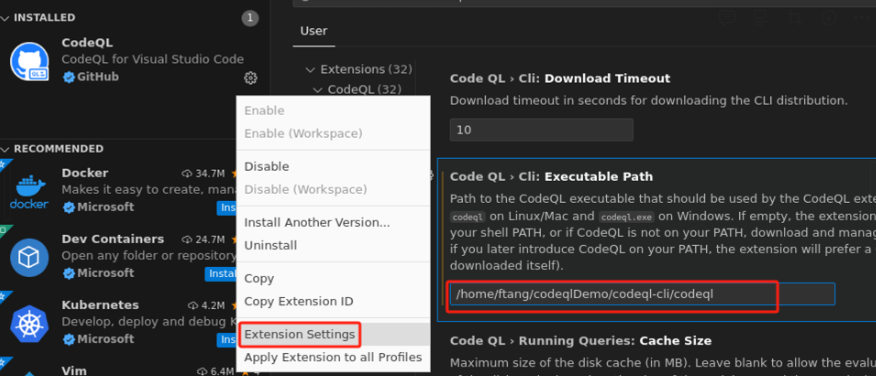
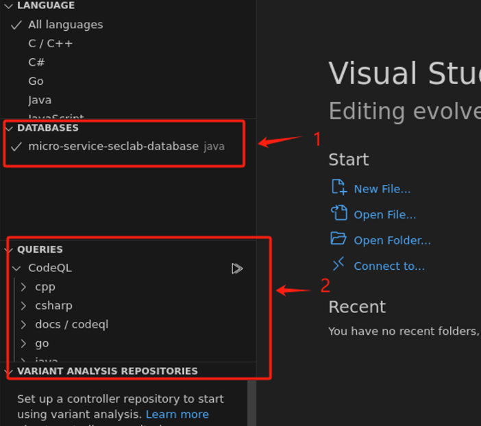
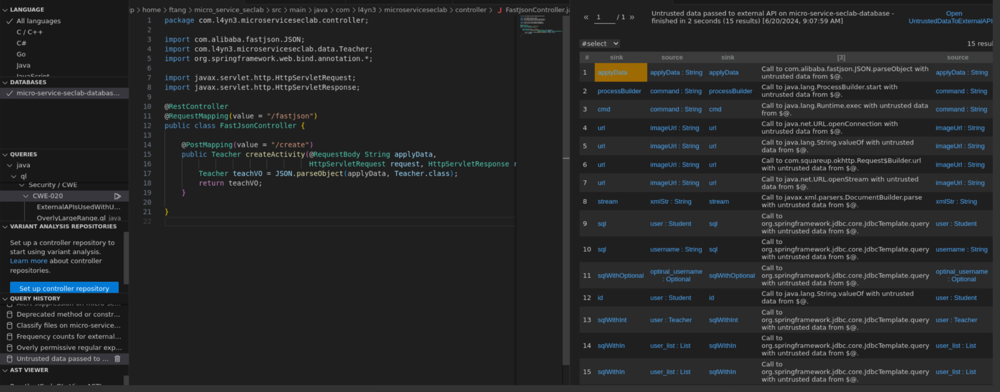

## codeql 安装

下载codeql cli 并把路径改为codeql-cli

https://github.com/github/codeql-cli-binaries/releases/download/v2.17.5/codeql-linux64.zip

下载codeql库

https://github.com/github/codeql.git

也可以用git clone https://gitee.com/mirrors/CodeQL.git 代替

```bash
ftang@ftang-virtual-machine:~/codeqlDemo$ ls
CodeQL  codeql-cli  codeql-linux64.zip
```

下载vscode，运行后下载codeql插件，并设置codeql执行文件路径：


然后vscode左下角就会出现codeql标识。

此时可以点击左上角 导入本地目录：我这里导入的是codeql目录。


暂时先不操作vscode

## 生成database

接下来生成database
以https://github.com/l4yn3/micro_service_seclab.git为例


这个Java漏洞靶场是基于SpringBoot开发，目的是用来检测SAST工具的准确性

下载 git clone https://github.com/l4yn3/micro_service_seclab.git

然后编译database

```bash
/home/ftang/codeqlDemo/codeql-cli/codeql database create micro-service-seclab-database  --language="java"   --source-root=micro_service_seclab
```

请注意：https://www.freebuf.com/articles/web/283795.html 这里使用

```
database create ~/CodeQL/databases/micro-service-seclab-database  --language="java"  --command="mvn clean install --file pom.xml" --source-root=~/CodeQL/micro-service-seclab/
```

我按照同样的方法报错：

去掉--command="mvn clean install --file pom.xml" 成功

## 导入数据库并执行查询



箭头1导入了刚才生成的数据库， 箭头2处出现了我们刚才导入的codeql项目目录，里面预定义了各种sq语句。

选择一个查询语句执行，下面是检查CWE漏洞的例子:



## 命令行运行

如果不想使用vscode[当然，vscode提供了很好的界面]

可以直接使用命令

**运行查询**

使用 CodeQL CLI 运行查询，假设数据库路径为 `path/to/database`，查询文件路径为 `path/to/sql_injection.ql`：

```
codeql query run -d path/to/database path/to/sql_injection.ql
```

**查看结果**

查询运行后，结果将显示在终端中。如果希望将结果保存为 JSON 文件，可以使用以下命令：

```
codeql query run -d path/to/database path/to/sql_injection.ql --output=result.json

```