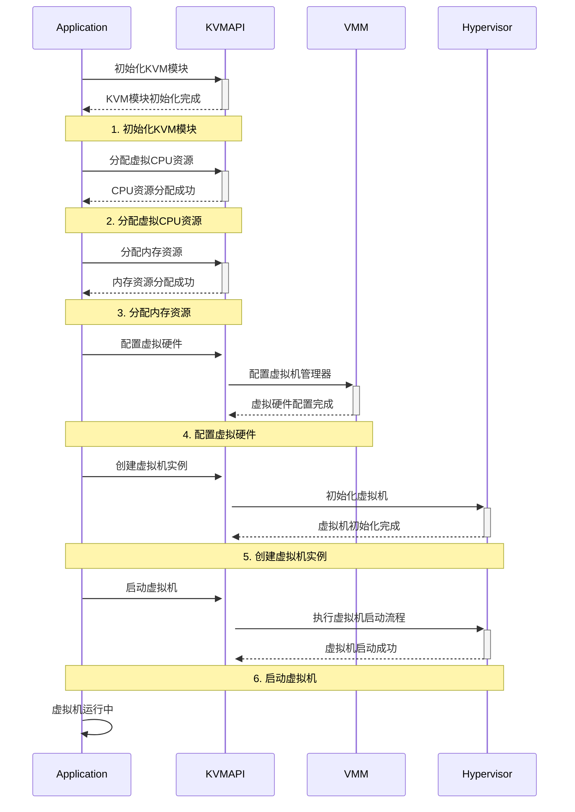

上面提供的Mermaid序列图描述了使用KVM（Kernel-based Virtual Machine）API创建和启动虚拟机的过程。这个过程可以分为以下几个主要步骤：

- 初始化KVM模块:

    - 应用程序(Application)调用KVM API(KVMAPI)来初始化KVM模块。这是创建虚拟机的第一步。
- 分配虚拟CPU资源:

    - 应用程序通过KVM API分配所需的虚拟CPU资源。这个步骤确保虚拟机拥有处理能力。
- 分配内存资源:

    - 应用程序通过KVM API分配虚拟机所需的内存资源。内存是虚拟机运行其操作系统和应用程序所必需的。
- 配置虚拟硬件:

    - 应用程序通过KVM API配置虚拟硬件，这可能包括网络接口、磁盘驱动器等。这一步涉及到设置虚拟机管理器(VMM)的参数。
- 创建虚拟机实例:

    - 应用程序请求KVM API创建一个新的虚拟机实例。KVM API会与Hypervisor通信，Hypervisor是管理虚拟机硬件虚拟化的软件。
- 启动虚拟机:

    - 应用程序通过KVM API请求启动虚拟机。Hypervisor会执行启动流程，这包括加载操作系统镜像、初始化系统服务等。
- 等待虚拟机运行:

    - 应用程序等待虚拟机完成启动并运行。一旦虚拟机启动成功，它可以开始执行其任务。
