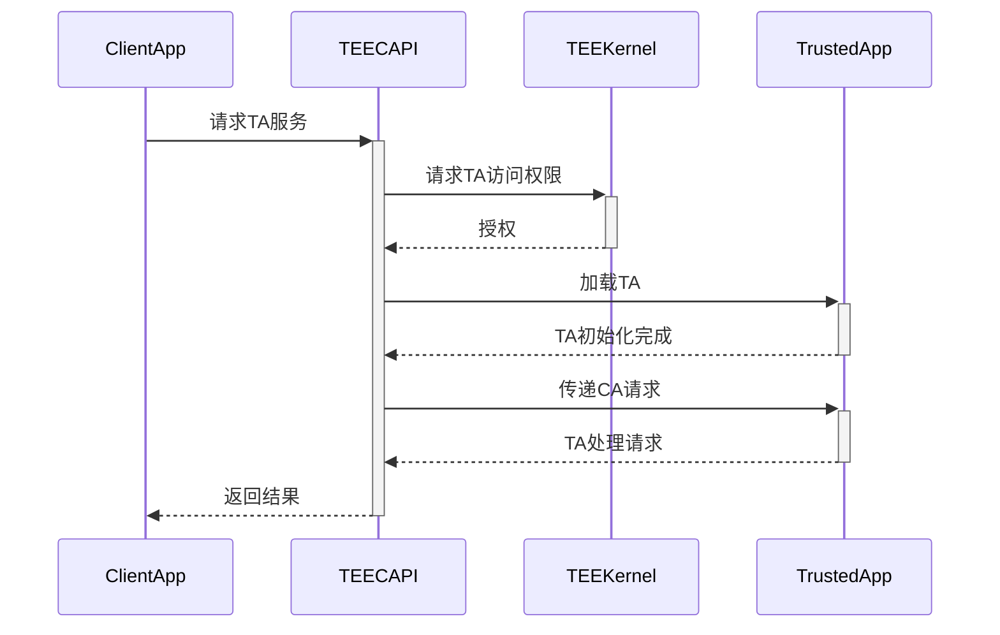
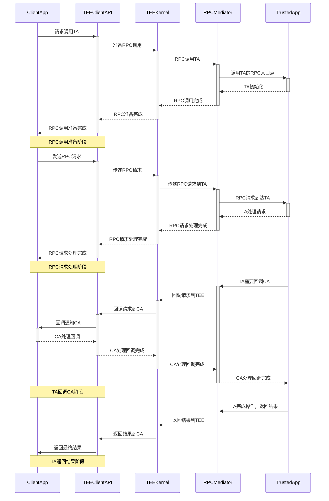

```mermaid
sequenceDiagram


    ClientApp->>+TEECAPI: 请求TA服务
    TEECAPI->>+TEEKernel: 请求TA访问权限
    TEEKernel-->>-TEECAPI: 授权
    TEECAPI->>+TrustedApp: 加载TA
    TrustedApp-->>-TEECAPI: TA初始化完成
    TEECAPI->>+TrustedApp: 传递CA请求
    TrustedApp-->>-TEECAPI: TA处理请求
    TEECAPI-->>-ClientApp: 返回结果
```

这个序列图描述了以下步骤：

- 客户端应用（CA）请求TEE中的可信应用（TA）服务。
- TEE客户端API（TEECAPI）向TEE内核（TEEKernel）请求访问TA的权限。
- TEE内核授权后，TEE客户端API加载TA。
- TA初始化完成后，TEE客户端API将CA的请求传递给TA。
- TA处理请求后，TEE客户端API将结果返回给CA。

``` mermaid
sequenceDiagram


    ClientApp->>+TEEClientAPI: 请求调用TA
    TEEClientAPI->>+TEEKernel: 准备RPC调用
    TEEKernel->>+RPCMediator: RPC调用TA
    RPCMediator->>+TrustedApp: 调用TA的RPC入口点
    TrustedApp-->>-RPCMediator: TA初始化
    RPCMediator-->>-TEEKernel: RPC调用完成
    TEEKernel-->>-TEEClientAPI: RPC准备完成
    TEEClientAPI-->>-ClientApp: RPC调用准备完成

    Note over ClientApp, TEEClientAPI: RPC调用准备阶段

    ClientApp->>+TEEClientAPI: 发送RPC请求
    TEEClientAPI->>+TEEKernel: 传递RPC请求
    TEEKernel->>+RPCMediator: 传递RPC请求到TA
    RPCMediator->>+TrustedApp: RPC请求到达TA
    TrustedApp-->>-RPCMediator: TA处理请求
    RPCMediator-->>-TEEKernel: RPC请求处理完成
    TEEKernel-->>-TEEClientAPI: RPC请求处理完成
    TEEClientAPI-->>-ClientApp: RPC请求处理完成

    Note over ClientApp, TEEClientAPI: RPC请求处理阶段

    TrustedApp->>+RPCMediator: TA需要回调CA
    RPCMediator->>+TEEKernel: 回调请求到TEE
    TEEKernel->>+TEEClientAPI: 回调请求到CA
    TEEClientAPI->>+ClientApp: 回调通知CA
    ClientApp-->>-TEEClientAPI: CA处理回调
    TEEClientAPI-->>-TEEKernel: CA处理回调完成
    TEEKernel-->>-RPCMediator: CA处理回调完成
    RPCMediator-->>-TrustedApp: CA处理回调完成

    Note over ClientApp, TEEClientAPI: TA回调CA阶段

    TrustedApp->>+RPCMediator: TA完成操作，返回结果
    RPCMediator->>+TEEKernel: 返回结果到TEE
    TEEKernel->>+TEEClientAPI: 返回结果到CA
    TEEClientAPI->>ClientApp: 返回最终结果

    Note over ClientApp, TEEClientAPI: TA返回结果阶段

```

